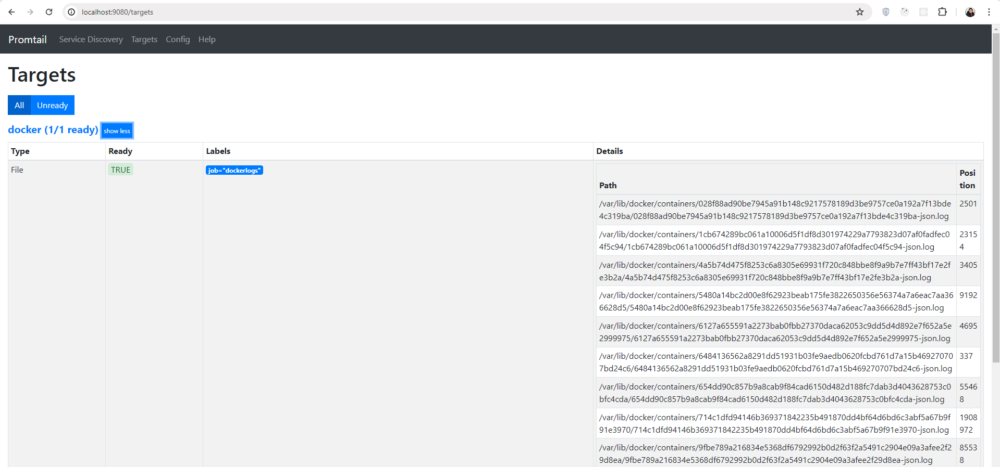

# Logging Stack Report

This report documents the logging stack setup for our applications, which includes Grafana, Loki, and Promtail.

## Components

### Grafana

Grafana is an open-source platform for monitoring and observability. It allows you to query, visualize, alert on, and understand your metrics no matter where they are stored. In our setup, we use Grafana to visualize the logs collected by Loki.

### Loki

Loki is a horizontally-scalable, highly-available, multi-tenant log aggregation system inspired by Prometheus. It is designed to be very cost-effective and easy to operate. Loki collects and indexes the logs from our applications.

### Promtail

Promtail is an agent which ships the contents of local logs to a private Loki instance or Grafana Cloud. It is usually deployed to every machine that has applications needed to be monitored. In our setup, Promtail is responsible for collecting logs from our applications and sending them to Loki.

## Setup

We have two applications, `app_javascript` and `app_python`, both of which are included in our `docker-compose.yml` file. Both applications use the `json-file` logging driver, with log files limited to a maximum size of 200k and a maximum of 10 files.

`Promtail -> Loki -> Grafana`

## Bonus Task

We extended the `docker-compose.yml` configuration to include an additional application. We also modified the logging stack's configuration to collect logs from all containers defined in the `docker-compose.yml`.

## Screenshots

### Grafana

### Loki

### Promtail

